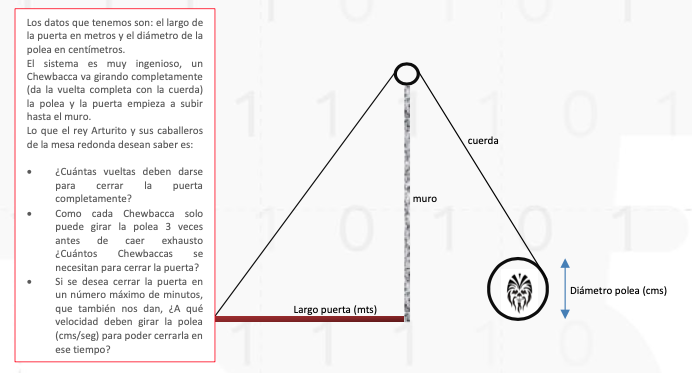

# reto_2-protegiendo_el_castillo_medieval

 Reto 2 - Ciclo 1 - Fundamentos de programación -Universidad de Caldas - MisionTIC 2022

## ¿Que se debe hacer?

Aplicar el proceso IDEAL completamente, es decir.
 
1. Identificar el problema
2. Definir el problema c. Estrategias
3. Algoritmos
4. Logros

Implementar la aplicación en Python

1. Definiendo funciones con parámetros 
2. Invocando funciones correctamente 
3. Documentando el código
4. Probando la aplicación

# Metodo IDEAL

## Descripcion del problema

**La puerta del castillo**
El rey Arturito (antecesor de R2D2), está muy preocupado porque le han informado que el ejército Vaderiano está muy cerca de su castillo con la idea de atacarlo. El castillo se encuentra realmente muy bien protegido por murallas y cañones, pero su talón de Aquiles es la gran puerta del castillo, que solo se puede cerrar bajo ataque, porque por allí entran víveres, productos y medicinas.
El problema es que se demoran mucho para cerrarla ya que esto se hace empujándola de abajo hacia arriba por los soldados Chewbaccas, que a pesar de su fuerza, en ocasiones no alcanzan a cerrarla completamente y el castillo es saqueado.
A oídos del rey ha llegado un plano elaborado por un tal Arquímedes (se sospecha que es un seudónimo) donde le plantea una solución al problema aunque no da muchos detalles. Aquí reproducimos el dibujo y las instrucciones.

# Solución

# Metodo IDEAL

### I: Identifiación del problema

Al rey Arturito le ha sido presentada una posible solución al problema que presenta la gran puerta de su castillo; Sin embargo, el rey desea conocer como funciona esta posible solución y poder dar respuesta a las siguientes incógnitas.
- ¿Cuántas vueltas deben darse para cerrar la puerta completamente? 
- Como cada Chewbacca solo puede girar la polea 3 veces antes de caer exhausto ¿Cuántos Chewbaccas se necesitan para cerrar la puerta? 
- Si se desea cerrar la puerta en un número máximo de minutos, que también nos dan, ¿A qué velocidad deben girar la polea (cms/seg) para poder cerrarla en ese tiempo?

**¿Quiénes son los interesados?**
- El rey Arturito y sus caballeros de la mesa redonda = Clientes
- Los Chewbaccas = Usuarios 
**¿Cuál es el objetivo?**
Crear un programa que pueda dar respuesta a estas incógnitas de manera automática, para que el rey Arturito y los chewbacas puedas reaccionar de forma oportuna ante las posibles amenazas de ataque.
**¿Se tienen restricciones?**
No.

### D: Definir el prblema

**¿Qué conozco?**
- En la solución que se plantea al problema del rey Arturito hay una polea que al ser girada por un chewbacca, comienza a subir la puerta hasta el muro.

- El largo de la medida de la puerta debe ser dada en Mts. y el diámetro de la polea debe ser dado en Cms.
- Cada Chewbacca puede girar la polea solo 3 veces antes de quedar exhausto.

**¿Qué información debo conocer?**
- Mecanismo de polea.
- Formula de convertir Mts. a Cms.
- Formula para calcular el radio.
- Formula para numero de vueltas.
- Formula para calcular el numero de hombres Chewbaccas necesarios para la operación.
- Formula para calcular velocidad angular.
- Formula para calcular velocidad lineal.

**Dividir el problema en subproblemas**
- Calcular la conversión de Mts. a Cms.
- Calcular el radio de la polea.
- Calcular la conversión de minutos a segundos.
- Calcular el numero de vueltas.
- Calcular numero de Chewbaccas para la operación y redondear el resultado.
- Calcular velocidad angular.
- Convertir velocidad angular en  velocidad lineal. 

### E: Estrategias

**Ejemplos particulares**
Debido a que la medida del diámetro de la polea es dada en (cms) y la longitud de la puerta es dada en (mts) será necesario primero convertir los mts. de la longitud de la puesta en cms.
Supongamos que la longitud de la puerta es 8 mts.
Entonces:
8*100=800
La longitud de la puerta en Cm es 800
Revisando la formula que calcula el numero de vueltas se hace necesario calcular el radio de la polea y convertir la longitud de la puerta en πCms para aplicar estos valores en la formula.
Supongamos que el diámetro de la polea es de 120 cm
Calculamos radio
r=  d/2
  120/2=60
El radio de la polea es 60 cm
Ahora convertiremos los minutos en segundos
s=min*60
Un minuto equivale a 60 segundos
Usaremos la formula para calcular el numero de vueltas de la polea.
N_v=  L_c/(2π*r)
Remplazamos
N_v=(800 Cm)/(2π*60cm)=(800 Cm)/(376.98 Cm)=2.12
Para cerrar completamente una puerta de 8Mts. se hacen necesario 4.24 vueltas en la polea
Ahora, si sabemos que cada Chewbacca puede dar solo 3 vueltas en la polea ante de quedar exhausto. Usaremos la siguiente operación para calcular cuantos hombre son necesarios para cerrar la puerta completamente.
2.12/3=0.7
Se necesitarían 0.7 hombres para cerrar completamente la puerta. Sin embargo redondeamos  a 1 ya que el numero de hombres debe ser entero.
Ahora, suponiendo que la puerta se cerrara completamente en un minuto y dará 2.12 vueltas en esa franja de tiempo, procedemos a calcular la velocidad angular

ω=(2.12 rev)/min*2πrad/rev*(1 min.)/(60 seg.)=(4.24 πrad)/(60 seg.)=0.070 πrad/s
0.070*π=0.219 rad/s
convertiremos esa velocidad angular en velocidad lineal usando la formula
0.219 rad/s*60Cm=13.14 cm/s
La polea deberá ser girada a una velocidad de 13.14 cm/s para ser cerrada en el tiempo de 1 minuto.

**Estrategia de solución** 
De acuerdo a lo visto en el ejemplo anterior podemos decir que para resolver las incognitas que desea aclarar el rey Arturito es necesario:
- Obtener  valores de la situación inicial 
- Realizar conversiones y cálculos intermedios para poder usar de forma adecuada las formulas dadas 
- usar cada una de las formulas expuestas para llegar al el resultado final

### A: Algoritmos
Requerimientos de software a cada subproblema
- el programa deberá solicitar los valores de longitud, diámetro inicialmente y tiempo en el que se desea cerrar la puerta
- Convertir Mts. a Cms: el programa deberá hacer la conversión directa utilizando la formula dada
- Calcular el radio de la polea: el programa deberá hacer la conversión directa utilizando la formula dada
- Convertir minutos a segundos: el programa deberá convertir el valor de minutos en segundos para poder hacer los cálculos correspondientes de velocidad.
- Calcular el numero de vueltas: el programa deberá remplazar los valores en la formula y ejecutarla para del el resultado correspondiente 
- Calcular numero de Chewbaccas para la operación: el programa usara el resultado de numero de vueltas y lo aplicara a la formula dada para el calculo correspondiente.
- Redondear numero de hombre Chewbacas: debido a que el resultado en el numero de hombres puede ser decimal, el programa debera redondearlo ya que esto se debe trabajar en números entero pues los hombre no pueden dividirse.
- Calcular velocidad angular: el programa usara el resultado de numero de vueltas y lo aplicara a la formula dada para el calculo correspondiente.
- Convertir velocidad angular en  velocidad lineal: El programa usara el resultado dado por el calculo anterior y ejecutara la formula dada para el nuevo resultado.

**Algoritmo**
1. Obtener valores de diámetro de polea, longitud de puerta y tiempo de cerrado de la puerta.
2. Calcular la conversión Mts. a Cms.
3. Calcular radio de la polea.
4. Calcular la conversión minutos a segundos.
4. Calcular la formula de numero de vueltas.
5. Calcular formula dada para calcular numero de hombre Chewbaccas necesarios.
6. Redondear el resultado obtenido en el calculo de hombres chewbaccas necesario.
7. calcular la formula para la velocidad angular.
8. calcular la formula para convertir velocidad angular en velocidad lineal.
9. Retornar numero de vueltas, numero redondeado de Chewbaccas necesarios, velocidad de la polea.

## L= Logros

Impementacion del cogigo en Python.

